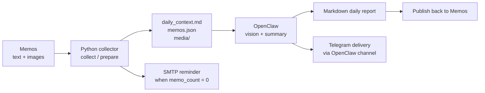

# Memos Daily Report Bridge
## Memos + Python + OpenClaw Daily Reporting Workflow

一个面向 `Memos` 的轻量自动化桥接项目：它先用 `Python` 读取当天的文字和图片，再把整理后的上下文交给 `OpenClaw` 做多模态总结，最后支持把日报写回 `Memos`，并在没有记录时通过 `SMTP` 发送提醒。

A lightweight automation bridge for `Memos`: use `Python` to collect text and images for the day, hand the normalized context to `OpenClaw` for multimodal summarization, write the report back to `Memos`, and send `SMTP` reminders when the day is still empty.

## Highlights | 项目亮点

| Feature | English | 中文 |
| --- | --- | --- |
| Daily collection | Pull one day of memos and attachments with the official `/api/v1` API. | 通过官方 `/api/v1` API 拉取某一天的 memo 和附件。 |
| Image-aware context | Download memo attachments into a local workspace so OpenClaw can inspect images. | 把图片附件下载到本地工作区，方便 OpenClaw 直接读图总结。 |
| Empty-day reminder | If there is no memo yet, send an SMTP reminder before retrying later. | 如果当天还没有记录，会先发 SMTP 提醒，再稍后自动重试。 |
| Report publishing | Publish generated Markdown back into Memos as a new memo. | 把生成好的 Markdown 日报重新写回 Memos。 |
| NAS-friendly design | Keep the data work in Python and let OpenClaw focus on scheduling, reasoning, and Telegram delivery. | 把数据处理放在 Python，OpenClaw 专注调度、总结和 Telegram 投递，适合 NAS 场景。 |

## Architecture | 架构概览



## Repository Layout | 仓库结构

```text
memos-openclaw-daily/
├─ .env.example
├─ .gitignore
├─ docker/
│  └─ openclaw-python/
│     ├─ Dockerfile
│     ├─ Dockerfile.example
│     └─ compose.snippet.yml
├─ pyproject.toml
├─ README.md
├─ openclaw/
│  ├─ DAILY_REPORT_PROMPT.md
│  └─ NAS_SETUP.md
├─ scripts/
│  └─ run_memos_daily.sh
└─ src/
   └─ memos_daily_report/
      ├─ __init__.py
      ├─ __main__.py
      ├─ cli.py
      ├─ config.py
      ├─ memos_client.py
      ├─ models.py
      ├─ notifications.py
      └─ workflow.py
```

## How It Works | 工作流程

### 1. `collect`

Collect one day of memos, normalize them, and download any attachments into `runs/<date>/media/`.

按天收集 memo，整理结构化数据，并把附件下载到 `runs/<日期>/media/`。

### 2. `prepare`

Build the same daily context, then decide whether OpenClaw should continue right now:

- `ready`: there is enough content to generate a report
- `waiting_retry`: the day is still empty, so send an SMTP reminder and retry later
- `forced_ready`: continue anyway even if `memo_count == 0`

除了构建当天上下文，还会判断 OpenClaw 是否应该继续：

- `ready`: 已有内容，可以直接生成日报
- `waiting_retry`: 当天仍为空，会先发 SMTP 提醒，稍后再重试
- `forced_ready`: 即使 `memo_count == 0`，也允许继续生成

### 3. OpenClaw

OpenClaw reads `daily_context.md`, inspects referenced images, writes `report.md`, and can then publish the result back to Memos and announce it in Telegram.

OpenClaw 读取 `daily_context.md`，查看其中引用的图片，生成 `report.md`，然后可以把结果写回 Memos 并推送到 Telegram。

## Quick Start | 快速开始

### Can I just copy the project directory? | 可以直接拷贝项目目录吗？

Yes for the source code, no for the existing virtualenv.

源码目录可以直接拷贝，但现有虚拟环境不能直接照搬。

- You can copy the repository itself into your NAS or Docker-mounted workspace.
- Do **not** reuse the Windows `.venv/` directory inside Linux containers.
- Use [`scripts/run_memos_daily.sh`](./scripts/run_memos_daily.sh) to create a Linux-side `.venv-linux/` automatically.

- 你可以把整个仓库直接复制到 NAS 或 Docker 挂载目录。
- 但不要把 Windows 下生成的 `.venv/` 直接拿到 Linux 容器里用。
- 用 [`scripts/run_memos_daily.sh`](./scripts/run_memos_daily.sh) 自动创建 Linux 侧的 `.venv-linux/`。

### What gets auto-installed? | 哪些东西能自动装？

The wrapper script can automatically install Python **packages**, but not the system `python3` binary itself.

包装脚本可以自动安装 Python **依赖包**，但不能凭空安装系统级 `python3` 可执行文件。

- `scripts/run_memos_daily.sh` will create `.venv-linux/`
- it will run `pip install -e .`
- it will re-sync dependencies when `pyproject.toml` changes

- `scripts/run_memos_daily.sh` 会自动创建 `.venv-linux/`
- 自动执行 `pip install -e .`
- 当 `pyproject.toml` 变化时自动重新同步依赖

If your OpenClaw container does not contain `python3` and `python3-venv`, bake them into the image first.

如果你的 OpenClaw 容器里压根没有 `python3` 和 `python3-venv`，那就要先在镜像层装好。

### Install | 安装

```powershell
cd E:\workspace\github\memos-openclaw-daily
python -m venv .venv
.venv\Scripts\Activate.ps1
pip install -e .
Copy-Item .env.example .env
```

On Linux / NAS / Docker, prefer the wrapper script instead of calling `python -m ...` directly.

在 Linux / NAS / Docker 里，优先用包装脚本，不要直接手敲 `python -m ...`。

### Configure | 配置

Fill in `.env` with your own values.

把 `.env` 填成你自己的配置。

| Variable | English | 中文 |
| --- | --- | --- |
| `MEMOS_BASE_URL` | Base URL of your Memos instance. | 你的 Memos 实例地址。 |
| `MEMOS_TOKEN` | Personal access token from Memos settings. | 在 Memos 设置页生成的访问令牌。 |
| `MEMOS_TIMEZONE` | Timezone used for daily slicing and timestamps. | 日报分日和时间展示使用的时区。 |
| `MEMOS_OUTPUT_ROOT` | Directory for generated context and downloaded media. | 用来保存上下文文件和图片附件的目录。 |
| `SMTP_HOST` / `SMTP_PORT` | SMTP relay for empty-day reminders. | 当天无记录时用于提醒的 SMTP 网关。 |
| `SMTP_TO` | Destination address, often your smtp-telegram bridge. | 收件地址，通常是你的 smtp-telegram 桥接地址。 |

Example placeholders from [`.env.example`](./.env.example):

[`.env.example`](./.env.example) 里放的是占位示例：

```env
MEMOS_BASE_URL=https://memos.example.com
MEMOS_TOKEN=replace-with-your-memos-access-token
SMTP_HOST=smtp-relay.example.com
SMTP_PORT=2525
SMTP_USE_SSL=false
SMTP_USE_STARTTLS=false
```

### Test The Pipeline | 测试流水线

#### Collect context | 测试收集

```powershell
python -m memos_daily_report collect
```

Linux / Docker version:

Linux / Docker 版本：

```bash
bash ./scripts/run_memos_daily.sh collect
```

This creates:

会生成：

```text
runs/
├─ latest.txt
├─ latest_status.json
└─ 2026-04-10/
   ├─ daily_context.md
   ├─ memos.json
   ├─ workflow_state.json
   └─ media/
```

#### Prepare workflow | 测试准备阶段

```powershell
python -m memos_daily_report prepare
```

Linux / Docker version:

Linux / Docker 版本：

```bash
bash ./scripts/run_memos_daily.sh prepare
```

If the day is empty, `prepare` can send an SMTP reminder and mark the status as `waiting_retry`.

如果当天没有内容，`prepare` 会尝试发送 SMTP 提醒，并把状态写成 `waiting_retry`。

#### Force one run | 手动强制跑一次

```powershell
python -m memos_daily_report prepare --force
```

Linux / Docker version:

Linux / Docker 版本：

```bash
bash ./scripts/run_memos_daily.sh prepare --force
```

Use this when you still want OpenClaw to generate a report even though no memo exists yet.

如果当天暂时没有 memo，但你仍然想强制生成一次日报，就用这个命令。

#### Publish a report | 回写日报

```powershell
python -m memos_daily_report publish --content-file .\runs\2026-04-10\report.md
```

Linux / Docker version:

Linux / Docker 版本：

```bash
bash ./scripts/run_memos_daily.sh publish --content-file ./runs/2026-04-10/report.md
```

## OpenClaw Integration | OpenClaw 接入

Use [`openclaw/DAILY_REPORT_PROMPT.md`](./openclaw/DAILY_REPORT_PROMPT.md) as the prompt body for your scheduled task.

把 [`openclaw/DAILY_REPORT_PROMPT.md`](./openclaw/DAILY_REPORT_PROMPT.md) 作为 OpenClaw 定时任务的 prompt 内容。

Example:

示例命令：

```powershell
openclaw cron add `
  --name "Memos Daily Report" `
  --cron "30 22 * * *" `
  --tz "Asia/Shanghai" `
  --session isolated `
  --announce `
  --channel telegram `
  --to "<your Telegram chat id or -100...:topic:...>" `
  --message (Get-Content .\openclaw\DAILY_REPORT_PROMPT.md -Raw)
```

Important:

重点提醒：

- Do not use `--no-deliver` if you want Telegram delivery.
- Use `--announce --channel telegram --to ...` for actual Telegram notifications.

- 如果你想发到 Telegram，不要写 `--no-deliver`。
- 真实通知要写 `--announce --channel telegram --to ...`。

For NAS deployment details, see [`openclaw/NAS_SETUP.md`](./openclaw/NAS_SETUP.md).

NAS 部署细节见 [`openclaw/NAS_SETUP.md`](./openclaw/NAS_SETUP.md)。

## Docker Note | Docker 说明

If OpenClaw itself runs in Docker, the most reliable setup is:

如果 OpenClaw 本身跑在 Docker 里，最稳的方式是：

1. Build an OpenClaw image that already contains `python3` and `python3-venv`
2. Mount this repository into the container
3. Let `scripts/run_memos_daily.sh` manage `.venv-linux/` and Python packages

1. 先构建一个已经带 `python3` 和 `python3-venv` 的 OpenClaw 镜像
2. 再把这个仓库挂载进容器
3. 把 Python 包管理交给 `scripts/run_memos_daily.sh`

See [`docker/openclaw-python/Dockerfile`](./docker/openclaw-python/Dockerfile) for an upstream-based version with Python support already added.

可以直接参考 [`docker/openclaw-python/Dockerfile`](./docker/openclaw-python/Dockerfile)，这是基于上游官方 Dockerfile 的改造版，已经把 Python 运行时补进去了。

If you want a compose example that extends the official OpenClaw runtime image, there is a ready-to-adapt snippet:

如果你想要一个“基于 OpenClaw 官方运行时镜像再补 Python”的 compose 示例，可以直接参考这个片段：

- [`docker/openclaw-python/compose.snippet.yml`](./docker/openclaw-python/compose.snippet.yml)

## CLI Reference | CLI 说明

### `collect`

```powershell
python -m memos_daily_report collect --date 2026-04-10
python -m memos_daily_report collect --time-field updated_ts
python -m memos_daily_report collect --no-download-attachments
```

- `--date`: Target date in `YYYY-MM-DD`
- `--time-field`: `created_ts` or `updated_ts`
- `--output-root`: Override `MEMOS_OUTPUT_ROOT`
- `--no-download-attachments`: Skip attachment download

- `--date`: 指定 `YYYY-MM-DD` 日期
- `--time-field`: 使用 `created_ts` 或 `updated_ts`
- `--output-root`: 覆盖默认输出目录
- `--no-download-attachments`: 跳过附件下载

### `prepare`

```powershell
python -m memos_daily_report prepare
python -m memos_daily_report prepare --force
python -m memos_daily_report prepare --no-send-empty-reminder
```

- `--force`: Continue even when there is no memo
- `--no-send-empty-reminder`: Skip SMTP reminder

- `--force`: 即使没有 memo 也继续
- `--no-send-empty-reminder`: 不发送空记录提醒

### `publish`

```powershell
python -m memos_daily_report publish --content-file .\runs\2026-04-10\report.md
```

- `--visibility`: `PRIVATE` / `PROTECTED` / `PUBLIC`
- `--tag`: Append a tag if it is missing

- `--visibility`: `PRIVATE` / `PROTECTED` / `PUBLIC`
- `--tag`: 如果内容里没有对应标签则自动补上

### `send-reminder`

```powershell
python -m memos_daily_report send-reminder
python -m memos_daily_report send-reminder --subject "Remember to log today" --body "A short note or photo is enough."
```

## Report Shape | 日报格式建议

```markdown
# 2026-04-10 日报

## 今日概览

## 时间线

## 吃了什么 / 生活片段

## 工作 / 学习 / 部署

## 想法与情绪

## 明日建议

#daily-report #ai-summary
```

## Why Python + OpenClaw | 为什么是 Python + OpenClaw

This repository intentionally keeps the data plumbing in Python and the multimodal reasoning in OpenClaw.

这个仓库故意把“数据搬运和整理”留给 Python，把“看图、总结、通知”交给 OpenClaw。

That split keeps the system easier to debug, easier to run on a NAS, and easier to extend into weekly or monthly reports later.

这种拆分更容易排错，也更适合 NAS 部署，而且后续扩展成周报、月报会更轻松。

## Troubleshooting | 排错

### `memoCount` stays `0`

Possible reasons:

可能原因：

1. The token belongs to another account.
2. You are looking at public memos from a different user.
3. The target day really has no memo yet.

1. token 对应的账号不是你正在查看的账号。
2. 你平时看到的是其他用户的公开 memo。
3. 目标日期当天确实还没有记录。

### SMTP reminder fails

- Make sure `SMTP_HOST` and `SMTP_TO` are both configured.
- Check `reminder_error` in `runs/latest_status.json`.

- 确保 `SMTP_HOST` 和 `SMTP_TO` 都已配置。
- 查看 `runs/latest_status.json` 里的 `reminder_error`。

### NAS and Memos are on the same machine

Prefer one of these in order:

优先顺序建议：

1. `http://127.0.0.1:5230`
2. `http://memos:5230`
3. `http://<nas-lan-ip>:5230`

## Safety Notes | 安全说明

- `.env` is intentionally ignored and should never be committed.
- `runs/` is ignored because it may contain downloaded private media.
- Keep public documentation generic; do not publish real PATs, private IPs, or relay addresses.

- `.env` 已被忽略，不应该进入版本库。
- `runs/` 已被忽略，因为里面可能包含私密图片和上下文。
- 公开仓库文档应使用占位符，不要暴露真实 PAT、内网 IP 或中继地址。

## References | 参考文档

- [Memos API](https://usememos.com/docs/api)
- [Memos ListMemos](https://usememos.com/docs/api/memoservice/ListMemos)
- [Memos Webhooks](https://usememos.com/docs/integrations/webhooks)
- [OpenClaw CLI Cron](https://docs.openclaw.ai/cli/cron)
- [OpenClaw Automation Tasks](https://docs.openclaw.ai/automation/tasks)
